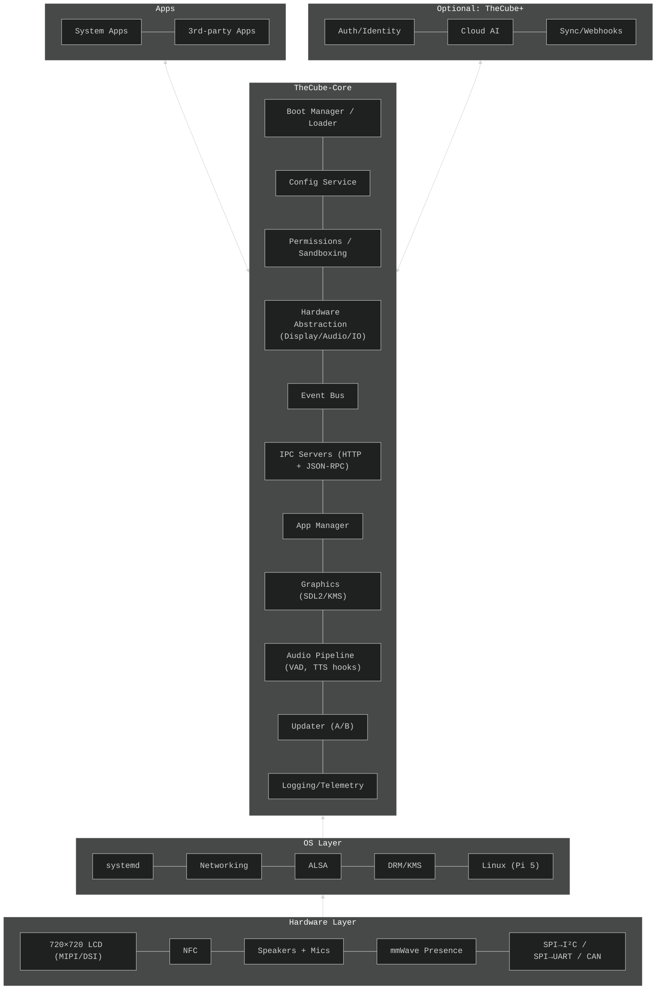
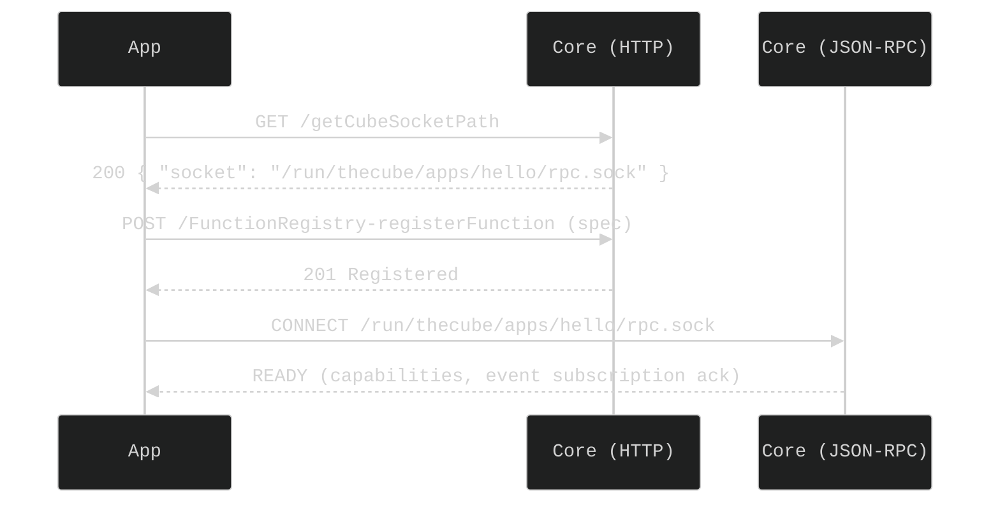
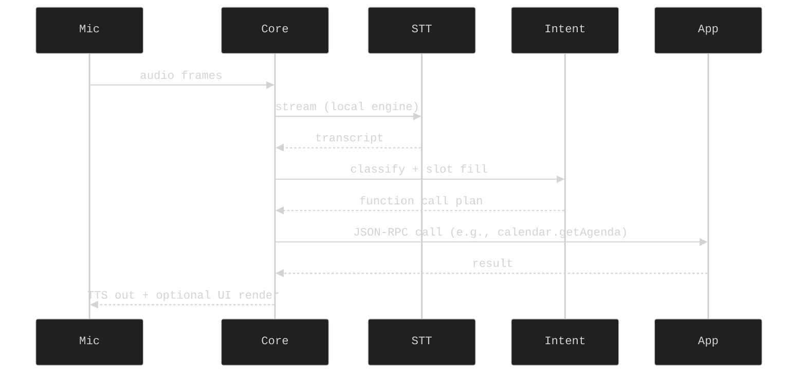

# Architecture

This page explains how **TheCube‑Core** is structured: the processes it runs, how apps talk to it, how it talks to hardware, and where cloud (TheCube+) fits in. If you think of TheCube as a mini OS, the Core is the runtime and API layer that everything else plugs into.

> If you’re new here, skim the **Layered Overview** and **Major Components** first, then jump to the flows that match what you’re building.

---

## Layered Overview



**Key ideas**

-   **Isolation by layers.** Apps never touch raw hardware—everything goes through Core APIs.
-   **Two IPC styles.** HTTP over localhost/IPC for multi‑client requests; JSON‑RPC over per‑app Unix sockets for low‑latency, bidirectional RPC.
-   **Event‑driven.** The Event Bus is the backbone for system → app and app → system messages.
-   **Local‑first.** Voice/STT/intent can run locally, with **TheCube+** as an optional augmentation.
-   **Safe updates.** A/B Core images with automatic rollback.

---

## Major Components

### Boot Manager / Loader

-   Performs minimal init, chooses active A/B slot, verifies signatures, and launches Core.
-   Exposes **safe mode** if boot fails repeatedly.

### Config Service

-   Central store for device settings, app permissions, and feature flags.
-   Sources: `/etc/thecube/*.yaml` (system defaults), `/var/lib/thecube/*.yaml` (mutable), and voluntary overrides from the web UI.

### Permissions & Sandboxing

-   App capabilities declared in manifest and enforced at runtime.
-   systemd unit templates + Landlock profiles restrict FS, network, and device access.

### Hardware Abstraction (HWA)

-   Unified, async APIs for **Display, Audio, Sensors, NFC, Bridges (I²C/SPI/UART/CAN)**.
-   Bridges are mediated (apps never open SoC buses directly).

### Graphics (SDL2/KMS)

-   Direct DRM/KMS output for the 720×720 panel.
-   Provides primitives for **characters**, scenes, and notification toasts.

### Audio Pipeline

-   Mic → VAD → Wakeword → STT (local or cloud) → Intent Router.
-   TTS out; tone/beep generator for low‑latency feedback.

### Event Bus

-   Pub/sub within Core & apps; JSON envelopes; backpressure and delivery guarantees.

### IPC Servers

-   **HTTP (localhost or shared IPC socket)**: multi‑client, simple REST.
-   **JSON‑RPC (per‑app Unix socket)**: function calls, streams, and callbacks.

### App Manager

-   Install/enable/update/remove; health checks; crash policy; resource budgets.

### Updater (A/B)

-   Download, verify, stage to inactive slot; flip on reboot; rollback on failure.

### Logging & Telemetry

-   Structured logs (spdlog); redaction rules; rotating files; optional Cloud export.

---

## Processes & Boundaries

-   **Core** runs as a supervised service (`thecube-core.service`).
-   **Apps** run as individual systemd services with generated units (`cube-app-<name>.service`).
-   **Per‑app Unix socket** at a managed path, permissions set by Core at app launch.
-   **No direct /dev access** by apps unless granted via capabilities.

---

## IPC Overview

### HTTP (shared)

-   **Default port:** 55280 (localhost) or **shared Unix socket** for intra‑box traffic.
-   Example endpoints (subset):
    -   `GET /getCubeSocketPath` → returns app’s JSON‑RPC socket path assigned by Core.
    -   `POST /FunctionRegistry-registerFunction` → register one or more functions (metadata below).
    -   `POST /events/publish` → publish app events onto the Event Bus.
    -   `GET /config/:key` / `PUT /config/:key` → read/write app‑scoped config.

### JSON‑RPC (per app)

-   **Transport:** Unix domain socket at `…/apps/<name>/rpc.sock` (path provided by Core).
-   **Use cases:** low‑latency callbacks, streams (e.g., frame or audio chunks), bidirectional function calls.

#### Function Registry — metadata (draft)

```json
{
    "app": "com.example.hello",
    "functions": [
        {
            "name": "getUnreadCount",
            "version": "1.0.0",
            "inputs": { "label": "string?" },
            "returns": { "count": "int" },
            "permissions": ["network"],
            "timeout_ms": 1000,
            "idempotent": true
        }
    ]
}
```

-   Core stores function specs; makes them discoverable; handles timeouts; applies capability checks.

---

## Event Bus Model

-   **Envelope**

```json
{
    "topic": "system.presence",
    "ts": 1732212345,
    "source": "core",
    "priority": "normal",
    "payload": { "state": "present", "confidence": 0.94 }
}
```

-   **Topics** (examples)
    -   `system.presence`, `system.network`, `system.power`
    -   `ui.toast`, `ui.banner`
    -   `audio.wake`, `audio.stt.partial`, `audio.stt.final`
    -   `app.<id>.event.*` (namespaced per app)
-   **Delivery**: in‑proc pub/sub with bounded queues; backpressure drops low‑priority events first (configurable).
-   **Subscriptions**: apps declare topic filters at registration; Core enforces quotas.

---

## Typical Flows

### 1) App startup & registration



### 2) Voice command (local‑first)



### 3) Cloud assist (optional TheCube+)

If local STT/intent is disabled or insufficient, Core calls cloud services via TheCube+; the rest of the flow is the same.

---

## Configuration Model (draft)

-   **Files**
    -   System defaults: `/etc/thecube/*.yaml`
    -   Device state: `/var/lib/thecube/*.yaml`
    -   Per‑app config: `/var/lib/thecube/apps/<id>/config.yaml`
-   **Precedence**: app overrides → device state → system defaults.
-   **Runtime API**: `GET/PUT /config/:key` (HTTP), or `config.get/config.set` (RPC).

---

## Performance & Responsiveness

-   **Targets**
    -   First‑boot to ready: < 20s
    -   Wakeword → TTS start: < 500 ms (local), < 1.5 s (cloud)
    -   Idle CPU: < 5%
-   **Levers**
    -   Pin hot paths (audio, wakeword) to isolated threads/cores.
    -   Zero‑copy buffers for audio/video.
    -   DRM/KMS direct to avoid compositor overhead.
    -   Backpressure policy on Event Bus + RPC timeouts.

---

## Security & Privacy (Core summary)

-   **Capabilities** per app (display, audio, sensors, bridges, network, storage‑scoped).
-   **Sandboxing** with systemd + Landlock; drop privileges; no raw bus access.
-   **Secrets** stored via kernel keyring or file‑based vault; never in logs.
-   **Telemetry** is opt‑in; redaction rules enforced at source.

(Deep dive: see [Security](/core/security/))

---

## Observability

-   **Logging**: structured (JSON), per‑service files under `/var/log/thecube/` with rotation.
-   **Debug flags**: `--trace` on Core and app launchers; dynamic log levels via config.
-   **Health**: `GET /health` (HTTP) returns component statuses; per‑app liveness via systemd.

---

## Extension Points

-   **Function Registry**: declare callable units with schemas, timeouts, and idempotency.
-   **Event Bus**: publish/subscribe to system topics; request UI surfaces (toasts/banners).
-   **Hardware APIs**: display primitives, audio sink/source, and bridged I/O transactions.

---

## See Also

-   [Install](/core/install/)
-   [Boot Sequence](/core/boot-sequence/)
-   [Configuration](/core/configuration/)
-   [Event Bus](/core/event-bus/)
-   [Lifecycle](/core/lifecycle/)
-   [Logging](/core/logging/)
-   [Performance](/core/performance/)
-   [Security](/core/security/)
